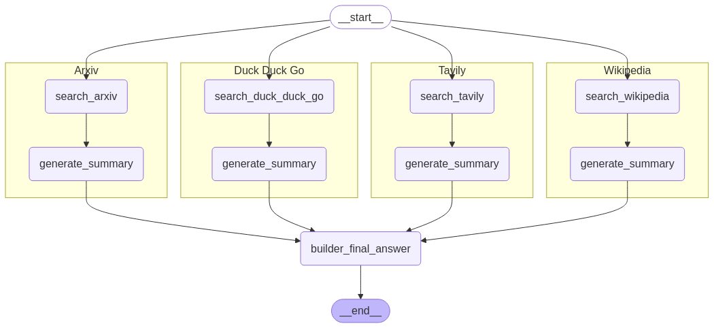

# Research Agent Framework

## Overview
This project implements a modular research assistant that orchestrates multiple search pipelines and synthesizes information into a final answer. It uses LangGraph to define state machines for different data sources (Arxiv, Tavily, DuckDuckGo, Wikipedia) and combines their outputs into a unified response, optionally saving results to MongoDB.

---



- **app.py**: Defines five state machines (`StateGraph`) for each source and a final answer pipeline, compiles them, and enters a REPL to process user questions.
- **services/llm_service.py**: Contains node functions for searching and summarizing using different tools and `ChatOpenAI`.
- **services/db_service.py**: Implements `MongoDBService` for persisting questions and answers.

---

## Features
- **Multi-Source Retrieval**: Query Arxiv, Tavily, DuckDuckGo, and Wikipedia in parallel.
- **Modular State Graphs**: Each pipeline is a LangGraph `StateGraph` that separates search and summarization nodes.
- **Unified Final Answer**: Aggregates intermediate summaries into a coherent final response.
- **Persistence**: Optionally store each Q&A session in MongoDB.
- **Visualization**: Generates a Mermaid PNG of the entire workflow.

---

## Requirements
- Python 3.8+
- `langchain`, `langchain_community`, `langgraph`, `pydantic`, `openai`, `python-dotenv`, `pymongo`

Install via pip:
```bash
pip install langchain langchain_community langgraph pydantic openai python-dotenv pymongo
```

---

## Setup
1. **Environment Variables**
   - Create a `.env` file with `MONGO_URI` for your MongoDB instance.
2. **Database Service**
   - Adjust `MongoDBService` parameters in `app.py` for your database/collection names.

---

## Usage
```bash
python app.py
```
- Enter your question at the prompt.
- The system runs each pipeline, generates intermediate summaries, and produces a final answer.
- The final Q&A document is printed and optionally saved to MongoDB.

---

## Extending
- **Add New Pipelines**: Define a new `StateGraph` with search and summarize nodes, then integrate into the entry graph.
- **Custom Nodes**: Implement additional LLM-powered nodes (e.g., fact-checking, translation).
- **UI Integration**: Replace the REPL loop with a web or API front-end.

---

## License
Distributed under the MIT License.

